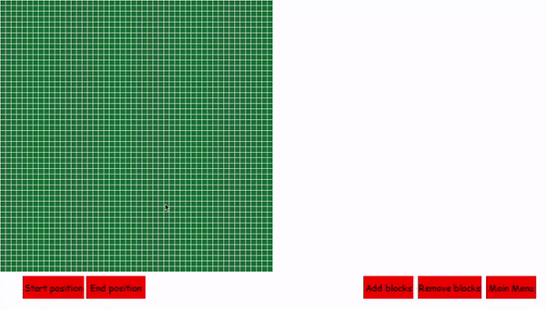
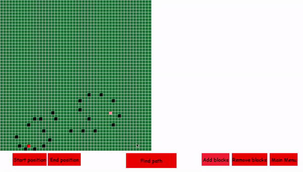
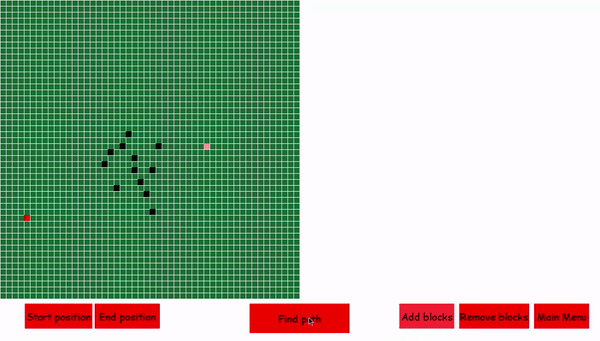
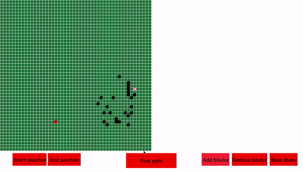

# Path visualization
## Using Depth-first Search, Breadth-first Search, Bidirectional search algorithm, A star path finding algorithm

Using pygame, the path visualization program will find a path from the start node to an end node.
You can choose a start node and an end node by yourself! You can also add and delete blocks!
Needs pygame module to work!!

## DFS:

## BFS: 

## Bidirectional 

## A-star

Note: A-star is a little bit inconsistent since the priority queue will not let different nodes with same fScore into it. I have added a tuple of `(fScore, count, node)` into it. The `count` variable will decrease as the path is more traversed. This makes the priority queue to compare the same fScored node with `count` and that has less count value will take more priority! 

Better method to remedy this situation will be appreciated! 

